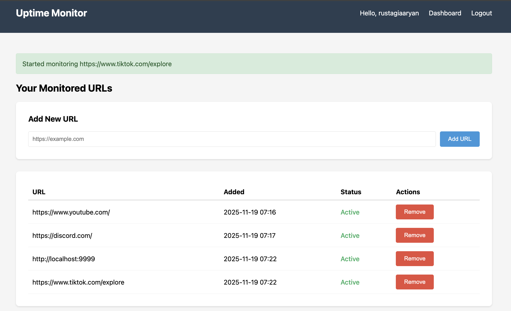
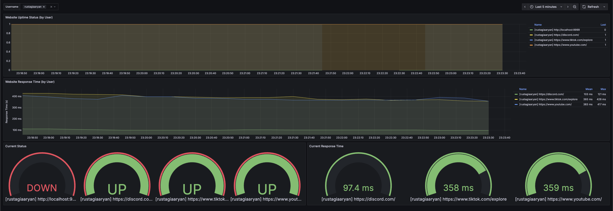

# FILE: README.md

# Website Uptime Monitor

A production-style multi-user website uptime monitoring system with a web interface for managing URLs, Prometheus for metrics collection, and Grafana for visualization.

## Features

- Multi-user support with authentication
- Web-based URL management (add/remove URLs)
- Real-time uptime monitoring
- Response time tracking
- Per-user Grafana dashboards with filtering
- Automatic Prometheus metrics collection
- Persistent database storage

## Tech Stack

- Python 3.10+
- Flask (Web UI)
- SQLAlchemy (Database ORM)
- Requests (HTTP monitoring)
- Prometheus Client Library
- Docker & Docker Compose
- Prometheus
- Grafana

## Prerequisites

- Docker
- Docker Compose

## How to Run

Start all services:

```bash
docker-compose up --build
```

This will start four services:
- **Web UI** (port 5001): User registration, login, and URL management
- **Monitor** (port 8000): Background service that checks URLs and exposes metrics
- **Prometheus** (port 9090): Metrics collection and storage
- **Grafana** (port 3000): Metrics visualization

## Getting Started

### 1. Create an Account

1. Navigate to http://localhost:5001
2. Click "Register here" to create a new account
3. Enter username, email, and password
4. You'll be automatically logged in after registration

### 2. Add URLs to Monitor

1. From your dashboard, enter a URL in the form (must start with http:// or https://)
2. Click "Add URL"
3. The monitor service will automatically start checking this URL every 15 seconds

### 3. View Metrics in Grafana

1. Navigate to http://localhost:3000
2. Login with credentials: **admin/admin**
3. Open the "Website Uptime Monitor" dashboard
4. Use the "Username" dropdown at the top to filter by specific users or view all
5. The dashboard shows:
   - Uptime status over time
   - Response time trends
   - Current status gauges
   - Current response time gauges

### 4. Remove URLs

From your dashboard, click "Remove" next to any URL to stop monitoring it. Historical metrics are preserved in Prometheus.

## Access Points

- **Web UI**: http://localhost:5001 (create account to get started)
- **Grafana**: http://localhost:3000 (login: admin/admin)
- **Prometheus**: http://localhost:9090
- **Monitor Metrics**: http://localhost:8000/metrics

## Architecture

### Services

- **web**: Flask application for user management and URL configuration
- **monitor**: Python service that reads from database and monitors URLs
- **prometheus**: Scrapes metrics from monitor service every 10 seconds
- **grafana**: Visualizes metrics with pre-configured dashboards

### Data Flow

1. Users register/login via the web UI and add URLs to monitor
2. URLs are stored in a SQLite database shared between web and monitor services
3. Monitor service queries the database for active URLs and checks them periodically
4. Monitor exposes metrics at `/metrics` endpoint with labels: url, user_id, username
5. Prometheus scrapes metrics from the monitor service
6. Grafana queries Prometheus and displays metrics in dashboards
7. Users can filter dashboards by username to see only their URLs

## Configuration

### Check Interval

Edit `app/config.py`:
- `CHECK_INTERVAL_SECONDS`: Time between URL checks (default: 15 seconds)

### Database

The application uses SQLite by default, stored in a Docker volume. To use a different database:
- Update `DATABASE_URL` environment variable in `docker-compose.yml`
- Supported: PostgreSQL, MySQL, or any SQLAlchemy-compatible database

## Metrics

All metrics include labels: `url`, `user_id`, `username`

- `website_up`: Gauge indicating if a website is up (1) or down (0)
- `website_response_time_seconds`: Histogram of response times in seconds

## Screenshots

### Web Dashboard
The web interface allows users to add and manage URLs to monitor:



### Grafana Metrics Visualization
Real-time monitoring data displayed in Grafana with customizable filters:



## Troubleshooting

**No data in Grafana:**
- Wait 1-2 minutes after adding URLs for metrics to populate
- Check that monitor service is running: `docker logs uptime-monitor-app`
- Verify Prometheus is scraping: http://localhost:9090/targets

**Can't login to web UI:**
- Ensure the web service started successfully: `docker logs uptime-monitor-web`
- Database is automatically initialized on first startup

**URLs not being monitored:**
- Check monitor service logs: `docker logs uptime-monitor-app`
- Verify URLs are marked as active in the dashboard
- Ensure URLs start with http:// or https://

## What I Learned

This project was a hands-on learning experience to understand observability and monitoring systems. The main goal was to learn how Prometheus and Grafana work together to collect and visualize metrics in a production-like environment.

### Key Takeaways

**Prometheus Metrics:** I learned how to expose custom metrics using the Prometheus client library and how to structure metrics with labels for multi-dimensional data. Understanding the difference between Gauges and Histograms was crucial for tracking both uptime status and response times effectively.

**Grafana Dashboards:** Working with Grafana taught me how to write PromQL queries to visualize time-series data. I learned how to create dashboard variables for filtering and how to provision dashboards automatically through configuration files instead of manual setup.

**Docker Compose Orchestration:** Managing multiple services (web app, monitoring service, Prometheus, Grafana) with Docker Compose showed me how to handle service dependencies, shared volumes for persistent data, and inter-container networking. The challenge of making services communicate properly (like Prometheus scraping metrics from the monitor) was a good lesson in container networking.

**Database Session Management:** I ran into SQLAlchemy DetachedInstanceError issues when trying to access database objects after closing sessions. This taught me the importance of proper session management and extracting data before closing database connections.

**Real-time Metric Cleanup:** One interesting challenge was making metrics disappear from Grafana immediately when URLs were removed. I learned that Prometheus doesn't automatically clean up old metrics, so I had to implement tracking of active URLs and explicitly remove metric labels when URLs were deactivated.

### Challenges Faced

The biggest challenge was understanding why metrics weren't updating in real-time when I expected them to. Debugging the metric cleanup required understanding how Prometheus stores time series data and how to properly remove them from the collectors.

Another challenge was getting the Grafana dashboard to auto-provision correctly with the right datasource configuration. It took some trial and error to understand the provisioning directory structure and YAML format.

### Future Improvements

If I were to extend this project, I would add email or Slack notifications when sites go down, implement historical uptime percentage calculations, and maybe add a status page that users could share publicly. It would also be interesting to add more advanced features like custom alert thresholds or integrating with external monitoring services.

Overall, this project gave me practical experience with monitoring infrastructure that's commonly used in production environments, which will be valuable for understanding how companies track the health of their systems.
